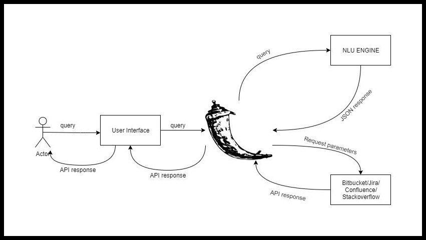
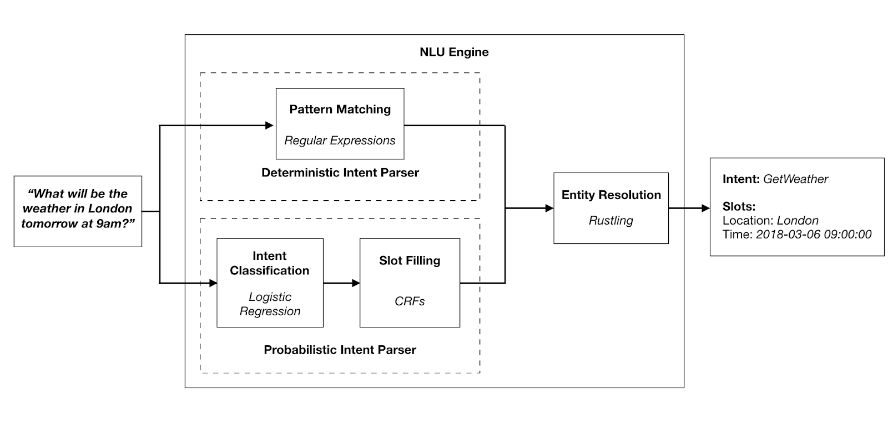

# JARVIS for Corporate

## K3RNEL-PAN1C.ASEC (Team Members)
- Atharva Veer (Team Leader)
- Yash Jain
- Harsh Chheda
- Kritika Ravishankar
- Dhwani Agarwal
- Divy Patel

## Technology Stack
- SNIPS NLU for intent parsing in chatbot
- Flask for server-side development
- HTML-CSS-JS Web technologies for building user interface
- Bootstrap for stying HTML
- SMTP@gmail.com for sending E-Mails

## Application Architecture


## Working of Chatbot


## Comparison between various Chatbots


## Features implemented
- Decent user-interface for chat interaction and result output
- Integrating chatbot to our application
- Supporting Stack-Overflow queries
- Sending response as a mail

## Features to be implemented
- MoM (Minutes of Meeting)
- Speech to Text
- 

<!-- # PPT Preparation
- [ ] Scalability
- [ ] Complexity
- [ ] Clarity
- [ ] Feasibility in the market
- [ ] Practicability
- [ ] UX
- [ ] Overall application performance benchmarking
- [ ] Prepare video of navigation

# Todo
- [ ] EMail HTML embedded (11 - 20) Y H
- [ ] Cross platform support (11 - 20) D Dh K
- [ ] Increase API features(include Write, Modify, Delete queries.) (11 - 20) D Dh K
- [ ] Speech to Text (11 - 20) D Dh K
- [ ] Text to Speech (11 - 20) D Dh K
- [ ] Refactor UI (11 - 20) Y H
- [ ] Inflate intents (11 - 20) A
- [ ] Optimize HTML templates for display (11 - 20) Y H
- [ ] Integrate Meeting feature (21 - 25) All In
- [ ] PPT Preparation (25 - 30) All In

# k3rnel-pan1c.asec
Smart India Hackathon 2020

## Setup for Frontend
```
cd frontend
```
```
npm install
```
```
node app.js
```
## Setup for NLU
```
cd NLU
pip install -r requirements.txt
```
```
python -m snips_nlu download en
``` -->