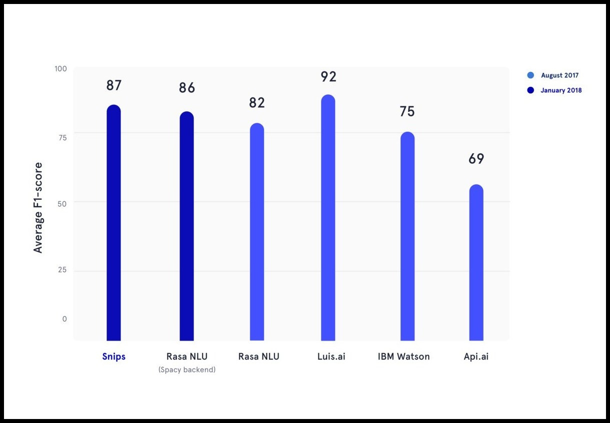

# JARVIS for Corporate
- Problem Statement Number : **SM446**
- Organization : **FIS Global**

## K3RNEL-PAN1C.ASEC (Team Members)
- **Atharva Veer (Team Leader)**
- **Yash Jain**
- **Harsh Chheda**
- **Kritika Ravishankar**
- **Dhwani Agarwal**
- **Divy Patel**

## Technology Stack
- **SNIPS NLU** for intent parsing in chatbot
- **Flask** for server-side development
- **Spacy** for extracting MoM entities from meeting texts
- **HTML-CSS-JS / Bootstrap** Web technologies for building user interface
- **PyDub** for chunking required for Minutes of the Meetings
- **SMTP@gmail.com** for sending E-Mails

## Application Architecture


## Features implemented
- User-interface to interact with chatbot via Speech generated or raw text user queries
- User-interface can display response of the query on the screen or can send via email
- Supports recording the meeting, summarizing and getting the appropriate details of the meeting from database depending on the keyword
- Supports **Stack-Overflow** queries
- Supports queries for Atlassian products:
    - **Jira**
    - **Confluence**
    - **Bitbucket**
- Supports **aggregated and comprehended** information retrieval through query

## Key Characteristics on Performance and Security metrics
- **Chatbot and application hosted on a server in the intranet**
- **No third party server interference**
- **Flexible code, easily pluginable interface**
- **Ability to identify closest queries even in case of mis-spelled utterances**


## Working of Chatbot


## Comparison between various Chatbots


## Installation and Setup

#### Prerequisite
```
    Python 3.7
    Local Instance of Jira, Bitbucket, Confluence running
```

#### Command to install the Python package dependencies
```
$ pip install -r requirements.txt
```

#### Command to install en(English) language support for SNIPS-NLU intent parser
```
$ python -m snips_nlu download en
```

#### Command to install Spacy's en(English) corpus
```
$ python -m spacy download en_core_web_sm
```

#### Train and load the chatbot model (Powershell script)
```
$ cd ./NLU/scripts
$ .\train_engine.ps1
```

#### Starting the server
```
$ python app.py
```

#### Application localhost URL
```
http://localhost:5000/
```

## References
- **Flask Official Documentation** : https://flask.palletsprojects.com/en/1.1.x/
- **SNIPS NLU Official Documentation** : https://snips-nlu.readthedocs.io/en/latest/
- **Spacy Official Documentation** : https://spacy.io/models/en
- **PyDub Official package source** : https://pypi.org/project/pydub/
- **Jira Server API Documentation** : https://docs.atlassian.com/software/jira/docs/api/REST/7.6.1/
- **Confluence Server API Documentation** : https://developer.atlassian.com/server/confluence/confluence-rest-api-examples/
- **Bitbucket Server API Documentation** : https://developer.atlassian.com/server/bitbucket/reference/rest-api/
